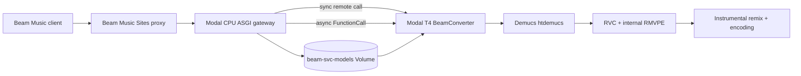

# Beam SVC Server

Beam SVC Server is the singing voice-conversion backend used by Beam Music. It accepts an audio upload, separates vocals with Demucs, converts the vocal stem with RVC and internal RMVPE pitch extraction, optionally remixes the converted vocal with the original instrumental, and returns MP3, WAV, or M4A audio.

The repository contains two execution modes:

- A local/self-hosted FastAPI application for development and dedicated servers.
- A Modal deployment with a CPU ASGI gateway and a scale-to-zero NVIDIA T4 worker for the Beam Music preview experience.

> [!WARNING]
> The deployed Modal endpoint is a staging/demo service. It currently has wildcard CORS and no authentication, user quota, or application-level rate limiter. Do not treat it as a production API until the controls in [Security and production hardening](#security-and-production-hardening) are implemented.

## Deployment status

| Component | URL | Status |
| --- | --- | --- |
| Beam Music web app | <https://beam-music.kimjiha1112.chatgpt.site> | Deployed preview UI |
| Modal SVC API | <https://kim-jiha95--beam-svc-t4-demo-gateway.modal.run> | Deployed staging/demo API |
| Voice preview limit | 15 seconds | Enforced by the Modal gateway |
| Available voices | 14 | Registry and model volume synchronized |

The Modal service exposes the API directly under `/ai-convert/*`. The Beam Music web application proxies that service through its own `/api/beam/*` routes.

## Implemented features

- Registry-driven voice discovery through `GET /ai-convert/voices`.
- 14 RVC voices, each with a checkpoint and FAISS retrieval index stored outside Git.
- Multipart audio uploads with a 25 MiB application limit.
- Input normalization and trimming with FFmpeg.
- Vocal/instrumental separation with the pretrained Demucs `htdemucs` model.
- RVC inference with RMVPE, CUDA half precision on Modal, per-voice index settings, and request-level tuning overrides.
- Automatic pitch policies based on the source singer's gender.
- Optional remix of converted vocals with the separated instrumental.
- MP3 at 192 kbit/s, AAC/M4A at 192 kbit/s, and 16-bit PCM WAV output.
- Short synchronous responses and pollable asynchronous conversion jobs.
- Chunked conversion to keep RVC inference stable on longer inputs.
- A persistent RVC subprocess on GPU workers, avoiding model initialization for every audio chunk.
- Correct model switching when every voice checkpoint has the same file name (`model.pth`): the worker now keys the active model by its fully resolved path.
- Local content-addressed output caching and stage-level timing diagnostics.
- Modal scale-to-zero deployment with a serialized T4 conversion worker.
- Smoke, asynchronous, matrix, and preset A/B QA scripts.

## Architecture



The gateway validates requests and submits work. GPU inference is isolated in `BeamConverter`, which mounts the model volume read-only. A single GPU container accepts one conversion at a time so the persistent RVC worker and CUDA memory are not shared by concurrent requests.

### Modal runtime specification

| Setting | CPU gateway | GPU converter |
| --- | ---: | ---: |
| Python | 3.10 | 3.10 |
| CPU | 1 core | 4 cores |
| Memory | 1,024 MiB | 16,384 MiB |
| GPU | None | NVIDIA T4 |
| Input concurrency | 50 | 1 |
| Maximum containers | 2 | 1 |
| Minimum containers | 0 | 0 |
| Scale-down window | 60 seconds | 300 seconds |
| Function timeout | 300 seconds | 900 seconds |
| Startup timeout | Default | 900 seconds |

The GPU image installs PyTorch and Torchaudio `2.5.1+cu121`, pins the RVC repository to commit `3b4a546cede4a1ea9f70e5fbd235a0f2bb83626c`, pins the Fairseq fork in `requirements.modal-gpu.txt`, verifies the downloaded HuBERT and RMVPE assets by SHA-256, and downloads `htdemucs` while building the image.

## Conversion pipeline

Each request follows this sequence:

1. Validate the voice, media type, output format, and upload size.
2. Normalize the source to 48 kHz stereo WAV with FFmpeg.
3. Apply `trim_start` and `trim_duration` when requested.
4. Probe the normalized duration.
5. Split audio into short PCM chunks when it exceeds the RVC chunk threshold: 4.5 seconds locally or 6 seconds on Modal.
6. Separate each chunk into vocal and instrumental stems with Demucs `htdemucs`.
7. Pass the vocal stem to RVC. The RVC engine performs RMVPE pitch extraction internally; the repository's `RMVPEService` stage currently exists for pipeline compatibility and timing, not as a second pitch extractor.
8. Apply the selected checkpoint, retrieval index, pitch shift, index ratio, consonant protection, filter radius, output sample rate, and RMS mix rate.
9. Remix the converted vocal with the instrumental when `mix_with_instrumental=true`; otherwise return the converted vocal only.
10. Concatenate processed chunks as 48 kHz stereo PCM and encode the requested output format.

Temporary request directories are deleted after conversion. Local cached outputs under `tmp/cache` are retained until manually removed.

## HTTP API

### Endpoints

| Method | Path | Purpose |
| --- | --- | --- |
| `GET` | `/ai-convert/health` | Runtime and model-volume readiness |
| `GET` | `/ai-convert/voices` | Voice catalog and inference defaults |
| `POST` | `/ai-convert/voice-conversion` | Synchronous or asynchronous conversion |
| `GET` | `/ai-convert/jobs/{job_id}` | Poll an asynchronous job |
| `GET` | `/ai-convert/results/{job_id}` | Download a completed job |

FastAPI also serves interactive local API documentation at `/docs` and an OpenAPI document at `/openapi.json`.

### Health response

Local and Modal health responses share the core fields:

```json
{
  "ok": true,
  "service": "beam-svc-modal",
  "version": "0.2.0",
  "gpu": true,
  "device": "cuda:0",
  "requireGpu": true,
  "modelsLoaded": true,
  "maxDemoSeconds": 15.0
}
```

`maxDemoSeconds` is Modal-specific. The Modal health check verifies that every registered checkpoint path exists in the mounted volume. It does not validate every index file, run an inference probe, or force a cold GPU container to start. The local health check is intentionally looser and reports models loaded when at least one registered checkpoint is present.

### Voice list response

`GET /ai-convert/voices` returns:

```json
{
  "voices": [
    {
      "voiceId": "dionn_v1_singing",
      "name": "Dionn V1 Singing",
      "category": "Default Male",
      "language": ["en"],
      "voiceType": "singer",
      "hasIndex": true,
      "recommendedUse": "male_singing",
      "pitchPolicy": {"female": -5, "male": 0, "unknown": 0},
      "model": {
        "engine": "rvc",
        "sampleRate": 48000,
        "indexRatio": 0.75,
        "protect": 0.33,
        "filterRadius": 3,
        "mixRate": 0.9,
        "modelPath": "weights/rvc/dionn_v1_singing/model.pth",
        "indexPath": "weights/rvc/dionn_v1_singing/added.index"
      }
    }
  ],
  "total_count": 14
}
```

`preview_url` is currently `null` for registry entries. The product's voice preview is produced by converting up to 15 seconds of the user's selected source audio; it is not a static sample bundled with each model.

### Conversion request

Send `POST /ai-convert/voice-conversion` as `multipart/form-data`.

| Field | Type | Default | Behavior |
| --- | --- | --- | --- |
| `source_audio` | file | required | Source MP3, WAV, M4A/MP4 audio, or generic binary audio; maximum 25 MiB |
| `voiceId` | string | required | Must match `model_registry/voices.json` |
| `voiceType` | string | none | Compatibility metadata; it does not currently select a different inference path |
| `source_gender` | string | `unknown` | `female`, `male`, or `unknown`; aliases are normalized and drive automatic pitch policy |
| `language` | string | `en` | Compatibility metadata; it does not currently branch inference behavior |
| `preserve_melody` | boolean/string | `true` | Accepted for client compatibility; RVC already follows source F0 and this flag does not currently branch behavior |
| `mix_with_instrumental` | boolean/string | `true` | Remix converted vocals with the separated instrumental |
| `output_format` | string | `mp3` | Supported formats: `mp3`, `wav`, `m4a` |
| `trim_start` | float | `0` on Modal | Non-negative source offset in seconds |
| `trim_duration` | float | `15` on Modal | Modal clamps this value to `0.1...15`; local async conversion has no application duration cap |
| `pitch_shift` | integer | automatic | Semitone override; see [Pitch policy](#pitch-policy) |
| `index_ratio` | float | registry value | RVC FAISS retrieval-index influence |
| `protect` | float | registry value | Protects unvoiced consonants from over-conversion |
| `filter_radius` | integer | registry value | Median filter radius used by RVC F0 processing |
| `mix_rate` | float | registry value | RVC RMS mix rate and final vocal remix gain |
| `return_job` | boolean | `false` | Return a job ID instead of waiting for audio |

The Modal gateway accepts `audio/aac`, `audio/mpeg`, `audio/mp4`, `audio/m4a`, `audio/x-m4a`, `audio/wav`, `audio/x-wav`, and `application/octet-stream`. Local accepted MIME types are a compatible subset. FFmpeg still determines whether the uploaded bytes are valid audio.

#### Synchronous example

```bash
curl --fail-with-body \
  -X POST \
  -F source_audio=@/path/to/source.m4a \
  -F voiceId=ariana_grande \
  -F source_gender=male \
  -F trim_start=0 \
  -F trim_duration=15 \
  -F output_format=mp3 \
  https://kim-jiha95--beam-svc-t4-demo-gateway.modal.run/ai-convert/voice-conversion \
  --output /tmp/beam_ariana_preview.mp3
```

Local synchronous responses include:

- `X-Beam-Cache: HIT|MISS`
- `X-Beam-Timings: { ...stage durations... }`

Modal synchronous responses include `X-Beam-Demo-Max-Seconds: 15.0`.

#### Asynchronous example

```bash
BASE_URL=https://kim-jiha95--beam-svc-t4-demo-gateway.modal.run

curl --fail-with-body \
  -X POST \
  -F source_audio=@/path/to/source.m4a \
  -F voiceId=the_weeknd \
  -F source_gender=female \
  -F trim_duration=15 \
  -F return_job=true \
  "$BASE_URL/ai-convert/voice-conversion"
```

The accepted response is:

```json
{"jobId":"fc-...","status":"queued"}
```

Poll and download it with:

```bash
curl "$BASE_URL/ai-convert/jobs/fc-..."
curl "$BASE_URL/ai-convert/results/fc-..." --output /tmp/result.mp3
```

Local job IDs begin with `svc_`; Modal job IDs are Modal FunctionCall IDs and normally begin with `fc-`. Modal reports coarse `50% / gpu_conversion` progress until the FunctionCall completes. Completed Modal results use `Cache-Control: private, max-age=3600`.

### Pitch policy

Pitch selection uses this precedence:

1. A non-zero `pitch_shift` request value.
2. The voice's policy for normalized `source_gender`.
3. The voice's `unknown` policy.
4. The model's `defaultPitchShift`.

For compatibility with the current Beam clients, an explicit `pitch_shift=0` means **automatic policy**, not a literal zero-semitone override. Consequently, a caller cannot force zero for a voice whose selected automatic policy is non-zero. Omit the field for automatic behavior as well.

## Voice catalog

The pitch-policy column is shown as `female source / male source / unknown source`, in semitones.

| Voice ID | Display name | Recommended use | Language | Model rate | Pitch policy |
| --- | --- | --- | --- | ---: | ---: |
| `dionn_v1_singing` | Dionn V1 Singing | Male singing | English | 48 kHz | -5 / 0 / 0 |
| `freya_idol` | Freya Idol | Female singing | Indonesian | 40 kHz | 2 / 8 / 2 |
| `taylor_swift_singer` | Taylor Swift | Female singing | English | 48 kHz | 3 / 10 / 3 |
| `the_weeknd` | The Weeknd | Male singing | English | 48 kHz | -7 / 0 / -7 |
| `ariana_grande` | Ariana Grande | Female singing | English | 40 kHz | 3 / 10 / 3 |
| `dua_lipa` | Dua Lipa | Female singing | English | 40 kHz | 0 / 8 / 0 |
| `lil_wayne` | Lil Wayne | Male rap | English | 40 kHz | -5 / 0 / 0 |
| `drake` | Drake | Male rap | English | 40 kHz | -5 / 0 / -5 |
| `chris_martin` | Chris Martin | Male singing | English | 40 kHz | 0 / 0 / 0 |
| `bad_bunny` | Bad Bunny | Male rap | Spanish | 40 kHz | -5 / 0 / -5 |
| `gari_and_luna_1` | Gari & Luna 1 | General singing | Unverified | 32 kHz | 0 / 0 / 0 |
| `gari_and_luna_2` | Gari & Luna 2 | General singing | Unverified | 32 kHz | 0 / 0 / 0 |
| `kehlani` | Kehlani | Female singing | English | 40 kHz | 0 / 8 / 0 |
| `macan` | Macan | Male rap | Russian | 40 kHz | -5 / 0 / 0 |

Quality notes:

- Rap-oriented checkpoints can sound less target-like on sustained singing sources.
- Gender and language for the two Gari & Luna checkpoints have not been QA-verified, so their policies remain neutral.
- Kehlani was produced from a short training run and needs additional listening QA.
- Model availability is not evidence of permission to use a person's name, voice, likeness, recordings, or derived checkpoint. Confirm dataset provenance, checkpoint licensing, consent, attribution, and deployment rights before public or commercial use.

## Model registry and storage

`model_registry/voices.json` is the source of truth for API metadata and inference defaults. Each voice uses this canonical repository layout:

```text
weights/
  rvc/
    <voiceId>/
      model.pth
      added.index
```

All `.pth` and `.index` files under `weights/rvc` are ignored by Git. The current catalog requires 28 binary artifacts and approximately 1.6 GiB of model storage. Commit registry metadata, not model binaries.

In Modal, the `beam-svc-models` Volume is mounted read-only at `/opt/beam/weights`. Therefore the repository path `weights/rvc/<voiceId>/model.pth` maps to the Volume path `/rvc/<voiceId>/model.pth`.

Create and populate the volume with:

```bash
.venv/bin/modal volume create beam-svc-models

.venv/bin/modal volume put --force \
  beam-svc-models \
  weights/rvc/<voiceId>/model.pth \
  /rvc/<voiceId>/model.pth

.venv/bin/modal volume put --force \
  beam-svc-models \
  weights/rvc/<voiceId>/added.index \
  /rvc/<voiceId>/added.index

.venv/bin/modal volume ls beam-svc-models /rvc
```

Repeat both upload commands for all 14 voice IDs. Upload only the active `model.pth` and `added.index`; backups and training checkpoints are not runtime artifacts. If only binary contents change, synchronize the Volume and roll or redeploy the app so new GPU containers see the latest data. Changes to paths, defaults, pitch policy, or voice metadata require both a registry commit and a Modal redeploy.

## Deploying to Modal

The deployment has been tested with Modal CLI `1.5.2`.

```bash
python3 -m venv .venv
source .venv/bin/activate
pip install "modal==1.5.2"
modal setup
modal deploy modal_app.py
```

Follow live logs with:

```bash
modal app logs beam-svc-t4-demo
```

The first conversion after scale-to-zero includes image/container startup, Demucs warmup, RVC initialization, and checkpoint load. Later calls on the same warm container are substantially faster. The T4 container scales down after five idle minutes.

### Modal demo limits

| Limit | Value |
| --- | ---: |
| Maximum upload read | 25 MiB + 1 byte for bounded validation |
| Maximum converted preview | 15 seconds |
| Minimum requested duration | 0.1 second |
| GPU conversions at once | 1 |
| GPU containers | 1 |
| Application output cache | None |

Both synchronous and asynchronous Modal submissions are clamped to 15 seconds. This is why the product UI must describe voice preview as **15 seconds**, not 5 seconds. A shorter result means the selected source had less usable audio after the requested offset or an older frontend/server revision was used.

## Local development

### API-only setup

`requirements.txt` contains the lightweight FastAPI layer. It is sufficient to start and inspect the API, but real voice conversion also needs the native/audio/GPU dependencies listed below.

```bash
python3 -m venv .venv
source .venv/bin/activate
pip install -r requirements.txt
cp .env.example .env
uvicorn app.main:app --reload --port 8081
```

### Full conversion prerequisites

- Python 3.10-compatible environment.
- FFmpeg and FFprobe on `PATH`.
- A compatible PyTorch/Torchaudio build for the selected CPU or CUDA device.
- Demucs 4 and its `htdemucs` weights.
- The pinned RVC checkout plus HuBERT, RMVPE, and Fairseq dependencies.
- All checkpoint/index pairs declared by the registry, or at least the voices being tested locally.

`requirements.modal-gpu.txt` is the reproducible dependency set used in the Modal GPU image. PyTorch is installed separately from the CUDA 12.1 wheel index.

Configure runtime paths in `.env`:

| Variable | Purpose | Modal value |
| --- | --- | --- |
| `BEAM_RVC_REPO` | RVC repository root | `/opt/rvc` |
| `BEAM_RVC_PYTHON` | Python used to invoke RVC | `/usr/local/bin/python` |
| `BEAM_DEMUCS_COMMAND` | Demucs executable | `demucs` |
| `BEAM_FFMPEG_COMMAND` | FFmpeg executable | `ffmpeg` |
| `BEAM_FFPROBE_COMMAND` | FFprobe executable | `ffprobe` |
| `BEAM_RVC_DEVICE` | RVC device | `cuda:0` |
| `BEAM_RVC_IS_HALF` | Half-precision inference | `true` |
| `BEAM_RVC_F0_METHOD` | RVC F0 method | `rmvpe` |
| `BEAM_REQUIRE_GPU` | Fail if CUDA is unavailable | `true` |
| `BEAM_RVC_WORKER_ENABLED` | Keep a persistent RVC subprocess | `true` |

CPU inference is available for development by setting the device to `cpu`, disabling half precision, and setting `BEAM_REQUIRE_GPU=false`. It is much slower than T4 inference and is not the deployed preview configuration.

## Beam Music web integration

Set the Sites runtime variable to the base Modal URL without a trailing API path:

```text
BEAM_SVC_URL=https://kim-jiha95--beam-svc-t4-demo-gateway.modal.run
```

The web application's server routes should proxy voice listing, conversion submission, job polling, and result downloads. After changing the Sites environment variable, redeploy the site revision so the runtime receives the new value. Do not expose a future service credential to browser JavaScript; attach it only in the server-side proxy.

## Caching and job lifecycle

### Local FastAPI

- Sync conversions use a SHA-256 content cache under `tmp/cache`.
- The key includes source bytes, voice ID, source gender, pitch policy, trim range, output format, remix selection, and all tuning overrides.
- Async jobs run through FastAPI background tasks and save completed audio to the same cache directory.
- Job metadata lives only in the process-local `JobStore` dictionary and is lost on restart.
- The cache is filesystem-local and is not coordinated across multiple API workers or hosts.
- A `return_job=true` request currently recomputes even if an equivalent synchronous cache entry exists.
- Synchronous conversion rejects normalized inputs longer than 60 seconds. Local asynchronous conversion has no application duration cap.

### Modal

- Async jobs are Modal FunctionCalls; their result retention and expiration follow Modal's platform lifecycle.
- The gateway does not implement the local content cache.
- A job can be queued behind the single T4 worker.
- Progress remains intentionally coarse because the gateway cannot observe internal stage callbacks while the remote function is running.

Use Redis/Postgres-backed jobs, object storage, an explicit retention policy, and a distributed queue before running the local application with multiple replicas.

## Verification and QA

### Static checks

```bash
python -m compileall -q app scripts modal_app.py
git diff --check

python - <<'PY'
from pathlib import Path
from app.services.registry import VoiceRegistry

voices = VoiceRegistry().list_voices().voices
ids = [voice.voiceId for voice in voices]
assert len(ids) == len(set(ids)) == 14
for voice in voices:
    assert voice.model is not None
    assert Path(voice.model.modelPath).is_file()
    if voice.hasIndex:
        assert voice.model.indexPath
        assert Path(voice.model.indexPath).is_file()
print("registry OK: 14 voices")
PY
```

### API smoke tests

```bash
BASE_URL=http://127.0.0.1:8081 \
VOICE_ID=dionn_v1_singing \
TRIM_DURATION=3 \
scripts/smoke_test.sh /path/to/source.mp3

BASE_URL=https://kim-jiha95--beam-svc-t4-demo-gateway.modal.run \
VOICE_ID=bad_bunny \
TRIM_DURATION=3 \
RETURN_JOB=true \
OUT_FILE=/tmp/beam_bad_bunny.mp3 \
scripts/smoke_test.sh /path/to/source.m4a
```

Additional tools:

- `scripts/async_job_test.sh` exercises submit, poll, and result download.
- `scripts/beam_svc_matrix_qa.py` runs a source-by-voice matrix and produces audio, CSV metrics, and a manual listening checklist.
- `scripts/beam_svc_ab_test.py` compares pitch, protect, index-ratio, and mix-rate presets.
- `scripts/ios_preview_request.sh` reproduces the preview-oriented client request.
- `scripts/test_client.py` is a minimal Python HTTP client.

There is not yet an automated unit/integration suite for pitch fallback, cache-key variation, mix-rate propagation, or same-file-name model switching. Use sequential multi-voice GPU smoke tests to exercise the critical worker switching path until those tests are added.

### Indicative Modal measurements

The following checks were observed on the deployed demo with short source clips. They validate deployment behavior, not an SLA:

| Case | Clip | Container state | Observed total |
| --- | ---: | --- | ---: |
| Bad Bunny | 3 seconds | Cold | 31.066 seconds |
| Macan | 3 seconds | Warm | 7.120 seconds |
| Gari & Luna 1 | 3 seconds | Warm | 7.306 seconds |
| The Weeknd | 3 seconds | Warm | 5.744 seconds |
| Freya Idol | 15 seconds | Warm | 28.205 seconds |

The tested outputs were three seconds long where expected and produced distinct SHA-256 hashes across target voices.

## Security and production hardening

Before exposing this service as a production or paid API:

1. Require a server-to-server bearer token or signed request at the Modal gateway.
2. Add per-user and per-IP rate limits, concurrency quotas, maximum queued work, and abuse controls.
3. Replace wildcard CORS with the exact Beam Music origins.
4. Configure cost budgets and alerts for GPU use, queue depth, failures, and cold-start frequency.
5. Put an upstream request-body limit in front of the application. The code reads at most 25 MiB + 1 byte from each uploaded file, but multipart parsing and transport limits should also be enforced by the edge.
6. Store durable job metadata and results with explicit expiration and deletion policies.
7. Avoid logging uploaded audio, derived audio, credentials, or full user-supplied filenames.
8. Add observability for latency, conversion errors, model load failures, and suspicious traffic.
9. Perform checkpoint provenance, consent, licensing, attribution, publicity-rights, trademark, and content-policy review for every voice.

The RVC worker calls `Config.use_insecure_load()` for compatibility with RVC PyTorch checkpoints. PyTorch checkpoint loading can execute serialized code. Only mount checkpoints from trusted, verified sources; never accept a user-uploaded `.pth` file.

The 15-second cap, one-GPU concurrency, and scale-to-zero configuration control demo cost and resource use. They are not authentication or abuse prevention.

## Known limitations

- The Modal endpoint is unauthenticated and staging-only.
- Voice metadata does not yet include static preview files.
- `voiceType`, `language`, and `preserve_melody` are accepted compatibility fields but do not change pipeline behavior.
- Explicit `pitch_shift=0` selects automatic pitch and cannot force literal zero for a non-zero policy.
- `RMVPEService` is a compatibility/timing stage; actual RMVPE inference occurs inside RVC.
- Modal health verifies checkpoint presence, not index validity or GPU inference readiness.
- Local health needs only one model, whereas Modal health requires all registered checkpoints.
- Local jobs and cache are single-process/single-filesystem implementations.
- Modal jobs expose coarse progress and no application-level conversion cache.
- Listening QA is still required; successful inference does not guarantee musical quality.
- Cold-start and conversion times vary with platform state, source content, chunk count, and model changes.

## Repository layout

```text
app/
  api/                    FastAPI routes
  models/                 API schemas
  services/               pipeline, Demucs, RVC, remix, cache, jobs
model_registry/
  voices.json             voice catalog and inference defaults
scripts/
  rvc_worker.py           persistent JSON-lines RVC worker
  smoke_test.sh           basic sync/async verification
  beam_svc_matrix_qa.py   source-by-voice QA matrix
  beam_svc_ab_test.py     inference preset comparisons
weights/rvc/              ignored local checkpoint/index storage
modal_app.py              Modal CPU gateway and T4 worker deployment
requirements.txt          lightweight local API dependencies
requirements.modal-gpu.txt Modal GPU image dependencies
```

Related operational notes are also available in `MODEL_LAYOUT.md`, `IOS_INTEGRATION_GUIDE.md`, `REALTIME_NOTES.md`, and `scripts/README.md`.
